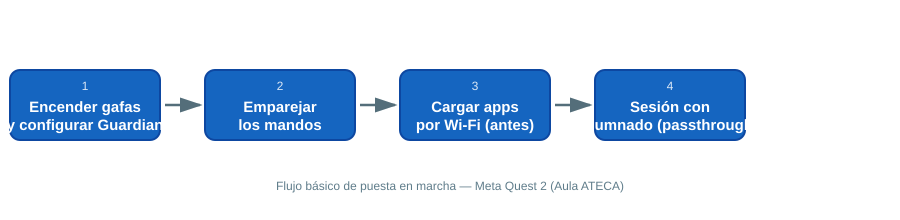

# 🕶️ Realidad Virtual (VR) y Realidad Aumentada (AR)

> Equipo del Aula ATECA para experiencias inmersivas: gafas de **VR autónoma** (Meta Quest 2) y **tablets para AR** (Samsung Galaxy Tab A 10.1). Útiles para simulación de procesos, formación técnica, anatomía, orientación/medición, simulacros de emergencias y proyectos de gamificación en cualquier familia profesional.

## 1. Meta Quest 2

Gafas de realidad virtual **autónomas** (no requieren PC ni cables). Resolución hasta 3664 × 1920 px, seguimiento completo de movimiento con mandos (*Touch Controllers*) y audio integrado.

### 1.1 Primer encendido y configuración

{ width="700" }

1. Mantén pulsado el botón lateral hasta que se encienda. Sigue el asistente inicial: red Wi-Fi, cuenta Meta y **calibración de altura del suelo**.
2. Delimita el área de juego (**Guardian**): con las gafas puestas, traza el perímetro libre de obstáculos alrededor del alumnado. Repite este paso **cada vez que cambies de aula o de disposición del mobiliario**.
3. Ajusta la **rueda de distancia interpupilar** (parte inferior del visor) para cada usuario/a: una mala calibración es la primera causa de mareo o visión borrosa.
4. Enciende los dos mandos (se emparejan solos al detectarse cerca del visor). Si no se detectan, mantén pulsados los botones Meta + B durante 5 segundos.
5. Entra en **Configuración → Dispositivo** para revisar batería y forzar la actualización de software antes de cada sesión con alumnado.

### 1.2 Uso en el aula

- Antes de cada sesión, **carga las apps por Wi-Fi** con antelación: las descargas grandes en directo pueden saturar la red del aula si hay varios visores a la vez.
- Para actividades de grupo, activa el modo **Cámara de paso** (*passthrough*, doble pulsación del botón lateral) para que el profesorado vea el entorno real mientras el alumnado lleva puestas las gafas.
- Usa **Emparejamiento de móvil** (app Meta Quest en el teléfono del profesor) para hacer *cast* de lo que ve el alumno en la pantalla digital del aula: muy útil para explicar en directo lo que se ve dentro del visor.
- Limpia lentes y almohadillas faciales entre usos (toallitas específicas para lentes; nunca alcohol puro directamente sobre el cristal).
- Guarda cada visor en su funda con el cable de carga enrollado; etiqueta cada mando con el número de equipo para agilizar la recogida.

### 1.3 Problemas frecuentes

| Síntoma | Causa probable | Solución |
|---|---|---|
| Imagen borrosa | Distancia interpupilar mal ajustada | Reajustar la rueda inferior del visor |
| El mando no responde | Pilas bajas o desincronizado | Cambiar pilas AA; reemparejar con Meta + B (5 s) |
| No detecta el suelo/Guardian | Suelo muy reflectante o iluminación pobre | Repetir configuración de espacio con luz encendida |
| Apps no se instalan en el aula | Red Wi-Fi saturada | Descargar apps el día anterior, no en el momento |

### 1.4 Aplicaciones recomendadas

- [Meta Horizon Store](https://www.meta.com/experiences/?srsltid=AfmBOooVbQuNHvo4x-sDRurTb_rIKirgLAwCxuNJ6XIjhuXZqGJ8KlSc){target="_blank"} – Tienda oficial de Meta.
- [SideQuest VR](https://sidequestvr.com/){target="_blank"} – Apps y juegos experimentales para Quest.
- [Familias Profesionales – VRFP](https://vrfp.es/familias-profesionales/todas-familias-profesionales/){target="_blank"} – Recursos VR organizados por familia profesional.
- [Simuladores VR para FP – Aulas ATECA](https://aulasateca.com/simuladores-de-realidad-virtual-para-fp/){target="_blank"} – Simuladores pensados para FP.
- [SteamVR](https://store.steampowered.com/steamvr?l=spanish){target="_blank"} – Compatible con Quest vía Link/Air Link.
- [Tilt Brush (AltspaceVR)](https://www.altlabvr.com/tilt-brush){target="_blank"} – Pintura 3D inmersiva.
- [Gravity Sketch](https://www.gravitysketch.com/pricing){target="_blank"} – Diseño 3D en VR.

> 💡 Idea de proyecto: usar la Meta Quest 2 para simulacros de coordinación de emergencias (ciclo de Seguridad y Medio Ambiente), inspirado en proyectos reales como **INNOFIRE-VR** en Aragón. Desarrollo completo en el documento de propuestas de proyectos del centro.

## 2. Tablets para Realidad Aumentada (Samsung Galaxy Tab A 10.1)

Tablet de gama media (pantalla 10.1″ Full HD, procesador Exynos 7904, 2-3 GB RAM, almacenamiento ampliable hasta 512 GB) usada como visor de apps de AR.

### 2.1 Puesta a punto antes de la clase

1. Instala las apps de AR **el día anterior** (algunas requieren acceso a cámara y descarga de assets 3D pesados).
2. Comprueba la carga de batería: las apps de AR consumen mucho por el uso continuo de cámara y GPU. Ten un cargador USB-C por cada 2-3 tablets.
3. Prepara una superficie plana y bien iluminada para el reconocimiento de marcadores/plano; evita suelos muy pulidos o superficies con reflejos.
4. Explica al alumnado que debe **mover ligeramente el dispositivo** al iniciar la app para que el sistema mapee el entorno antes de que aparezca el contenido 3D.

### 2.2 Apps de AR por ámbito

**Energía y agua**

- [AR Ruler](https://play.google.com/store/apps/details?id=com.grymala.aruler){target="_blank"} – Medición de distancias, áreas y volúmenes con AR.
- [Transportador de ángulos AR](https://www3.gobiernodecanarias.org/medusa/ecoescuela/educatablet/recurso/transportador-virtual){target="_blank"} – Medición de ángulos.
- [Brújula AR](https://www3.gobiernodecanarias.org/medusa/ecoescuela/educatablet/recurso/brujula-con-realidad-aumentada){target="_blank"} – Orientación y navegación.

**Sanidad**

- [Anatomy 4D](https://www3.gobiernodecanarias.org/medusa/ecoescuela/recursosdigitales/2015/01/24/anatomy-4d/){target="_blank"} – Cuerpo humano en 4D.
- [AR Human Organs](https://play.google.com/store/apps/details?id=com.onebyoneapps.arhumanorgans){target="_blank"} – Órganos humanos en 3D.
- [Essential Skeleton 3D](https://www3.gobiernodecanarias.org/medusa/ecoescuela/recursosdigitales/2014/11/25/essential-skeleton-4/){target="_blank"} – Modelo interactivo del esqueleto.
- [The Brain in 3D](https://www3.gobiernodecanarias.org/medusa/ecoescuela/recursosdigitales/2015/01/24/the-brain-in-3d/){target="_blank"} – Cerebro humano en 3D.
- [Anatomyou](https://www3.gobiernodecanarias.org/medusa/ecoescuela/recursosdigitales/2020/05/08/anatomyou/){target="_blank"} – Endoscopio virtual.

## 📚 Recursos

- 📖 [Guía oficial Meta Quest 2](https://www.meta.com/help/quest/){target="_blank"}
- 🎓 [VRFP – Familias Profesionales](https://vrfp.es/familias-profesionales/todas-familias-profesionales/){target="_blank"}
- 🧩 [Simuladores VR para FP](https://aulasateca.com/simuladores-de-realidad-virtual-para-fp/){target="_blank"}
- 🌐 Web del Aula ATECA (fuente de este manual): [Tecnologías | Aula AtecA](https://www3.gobiernodecanarias.org/medusa/proyecto/35014664-0006/aplicaciones/){target="_blank"}

> 📷 **Pendiente:** añadir aquí fotos reales del equipo del aula (visores en su estación de carga, tablets, sesión de alumnado) cuando se puedan tomar in situ.
