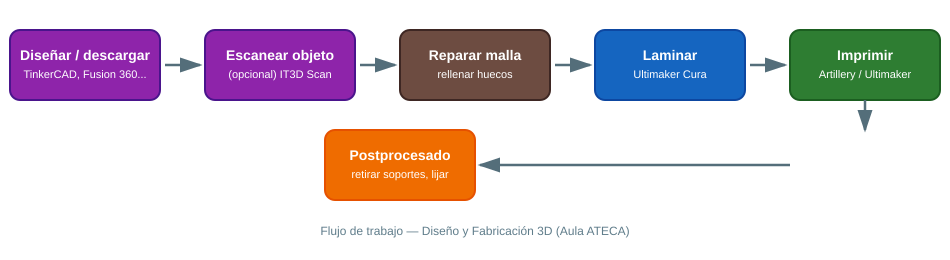

# 🛠️ Diseño y Fabricación 3D

> Equipamiento del Aula ATECA para modelado, escaneo e impresión 3D: dos impresoras (Artillery Genius Pro y Ultimaker) y un escáner 3D (IT3D Scan). Para descargar diseños ya hechos y listos para imprimir, consulta el documento [Repositorios de diseños 3D gratuitos](repositorios-diseños-3d-gratuitos.md).

## Flujo de trabajo general

{ width="800" }

Antes de entrar en cada máquina, conviene tener claro el recorrido completo: **diseñar o descargar → (opcional) escanear → reparar la malla → laminar → imprimir → postprocesar**. Saltarse el paso de reparar la malla es la causa más habitual de que una impresión falle a mitad de proceso.

## 1. Impresora 3D Artillery Genius Pro

Impresora FDM de alta precisión con extrusor de alto rendimiento, **cama caliente de vidrio** y **nivelación automática**. Compatible con múltiples materiales (PLA, PETG, ABS con precauciones).

### 1.1 Puesta en marcha

1. Enciende la impresora y lanza la **auto-nivelación asistida** desde el menú (sigue el asistente en pantalla; la máquina toca varios puntos de la cama para calcular el mapa de nivelación).
2. Precalienta el extrusor a la temperatura del material (ver tabla de temperaturas más abajo) y **carga el filamento** hasta que salga material limpio y continuo por la boquilla.
3. En Ultimaker Cura, selecciona el perfil "Artillery Genius Pro", ajusta la altura de capa (0.2 mm es un buen valor por defecto para piezas educativas) y **exporta el `.gcode`** a una tarjeta SD/USB.
4. Lanza la impresión y **vigila las 3-5 primeras capas**: si no se adhieren bien a la cama, para la impresión y revisa nivelación o limpieza de la superficie (alcohol isopropílico).

### 1.2 Temperaturas orientativas por material

| Material | Extrusor | Cama | Notas |
|---|---|---|---|
| PLA | 190-210 °C | 50-60 °C | El más fácil para empezar, poco olor |
| PETG | 220-240 °C | 70-80 °C | Más resistente, algo más difícil de imprimir |
| ABS | 230-250 °C | 90-100 °C | Requiere recinto cerrado; usar con ventilación |

### 1.3 Buenas prácticas en el aula

- Usa siempre una **falda (skirt/brim)** en piezas pequeñas o con poca base de apoyo.
- Comprueba la temperatura recomendada del filamento (suele venir impresa en la bobina) antes de cambiar de material.
- Guarda el filamento en bolsas herméticas con gel de sílice: la humedad es la causa más común de mala calidad de impresión (efecto "chisporroteo" al extruir).

## 2. Impresora 3D Ultimaker

Impresora profesional orientada a prototipado y piezas técnicas, con extrusión de filamento compatible con PLA, ABS y plásticos de ingeniería. Estructura robusta pensada para entornos industriales/educativos exigentes.

### 2.1 Puesta en marcha

1. Lamina el modelo con **Ultimaker Cura** seleccionando el perfil de la impresora Ultimaker del aula.
2. Comprueba el perfil de material (algunos requieren cama calefactada y recinto cerrado).
3. Transfiere el `.gcode` por USB o red (según el modelo disponible en el aula).

### 2.2 Buenas prácticas en el aula

- Prioriza esta impresora para piezas técnicas/funcionales que requieran más precisión dimensional (por ejemplo, piezas que deban encajar entre sí).
- Revisa boquilla y varillas de guía periódicamente (mantenimiento preventivo trimestral); una boquilla desgastada produce líneas de impresión irregulares.

## 3. Escáner 3D — IT3D Scan

Escáner que captura objetos y entornos en 3D con alta precisión, generando modelos que pueden editarse, repararse e imprimirse.

### 3.1 Flujo de trabajo básico

1. Coloca el objeto sobre una superficie neutra, con buena iluminación difusa (evita reflejos y superficies muy brillantes o transparentes: pulverizar spray mate ayuda en objetos metálicos o de vidrio).
2. Escanea rotando el objeto o el escáner según el modelo, cubriendo todos los ángulos; ve comprobando en pantalla que no quedan "agujeros" en la nube de puntos.
3. Exporta la malla (`.stl`/`.obj`) y **repárala** si es necesario (rellenar huecos, suavizar) con software como Meshmixer o el propio software del escáner.
4. Importa el modelo reparado en el *slicer* (Cura) para imprimirlo.

### 3.2 Buenas prácticas en el aula

- Los objetos pequeños y con detalle fino dan mejor resultado que piezas muy grandes.
- Evita escanear con luz solar directa cambiante (las sombras se mueven durante el escaneo): mejor luz artificial estable.

## 📚 Software de diseño y edición 3D

- [TinkerCAD](https://www.tinkercad.com/3d-design){target="_blank"} – Modelado online para iniciación, ideal en 1º de ciclos.
- [Fusion 360](https://www.autodesk.es/products/fusion-360){target="_blank"} – CAD profesional con simulación (licencia educativa gratuita).
- [SketchUp](http://www.sketchup.com/es/products/sketchup-for-web){target="_blank"} – Modelado intuitivo orientado a arquitectura/diseño.
- [FreeCAD](https://www.freecadweb.org){target="_blank"} – CAD paramétrico libre y gratuito.
- [Ultimaker Cura](https://ultimaker.com/es/software/ultimaker-cura){target="_blank"} – Laminador (*slicer*) gratuito, válido para ambas impresoras del aula.

## 📚 Recursos

- 🎥 [Vídeo de presentación del escáner IT3D Scan](https://youtu.be/xN-ANLl4h64){target="_blank"}
- 🎓 [Curso IT3D Scan ONE](https://formacion.it3d.com/curso/Curso-IT3D-Scan-ONE){target="_blank"}
- 📦 [Repositorios de diseños 3D gratuitos](repositorios-diseños-3d-gratuitos.md) — documento específico de este proyecto.
- 🌐 Web del Aula ATECA (fuente de este manual): [Tecnologías | Aula AtecA](https://www3.gobiernodecanarias.org/medusa/proyecto/35014664-0006/aplicaciones/){target="_blank"}

> 📷 **Pendiente:** añadir fotos reales de las dos impresoras y del escáner del aula, y ejemplos de piezas impresas por el alumnado.
