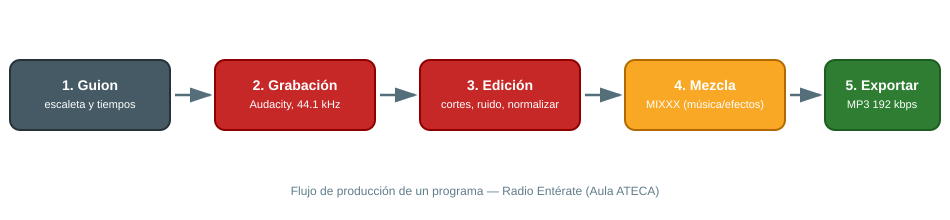

# 📻 Radio y Audio

> El Aula ATECA da soporte a **Radio Entérate**, la emisora escolar del CIFP Villa de Agüimes, donde el alumnado produce programas educativos y divulgativos. Este manual cubre el flujo de trabajo de grabación/edición y las herramientas disponibles.

## 1. Radio Entérate (emisora escolar)

Proyecto de radio educativa gestionado por alumnado y profesorado del centro, orientado a desarrollar creatividad, comunicación oral y trabajo en equipo.

### 1.1 Flujo de trabajo de un programa

{ width="800" }

1. **Guion**: se prepara escaleta con bloques, tiempos y locutores. Reparte turnos de palabra por escrito para evitar solapamientos en la grabación.
2. **Grabación**: en el aula, con micrófono conectado al PC y **Audacity** abierto en una pista estéreo a 44.1 kHz. Haz una prueba de 10 segundos antes de grabar el programa completo para comprobar niveles.
3. **Edición**: cortes, ecualización básica, eliminación de ruido de fondo y normalización de volumen en Audacity.
4. **Música/efectos**: mezcla de cortinillas y música con **MIXXX** si el programa incluye tramos musicales en directo o pregrabados tipo DJ set.
5. **Exportación**: MP3 a 192 kbps (buen equilibrio calidad/peso) para publicación o retransmisión.

### 1.2 Buenas prácticas

- Graba siempre con auriculares puestos para detectar ruidos en directo (soplidos, sillas, móviles).
- Deja 2-3 segundos de silencio al inicio y final de cada grabación (margen para edición).
- Guarda el proyecto de Audacity (`.aup3`) además del MP3 exportado, por si hay que retocar algo más adelante.
- Archiva cada programa con un nombre consistente: `AAAAMMDD-titulo-programa.mp3`, para poder encontrarlo fácilmente en el histórico de la emisora.

## 2. Audacity — edición de audio

Software libre y gratuito, estándar de facto en educación para grabación y edición de audio multipista.

### 2.1 Configuración básica

1. En **Editar → Preferencias → Dispositivos**, selecciona el micrófono del aula como entrada y los altavoces/auriculares como salida.
2. Ajusta el proyecto a 44.1 kHz / estéreo (o mono si es solo voz, para reducir peso de archivo).
3. Usa **Efectos → Reducción de ruido**: primero capturas una muestra de "solo ruido" (2-3 segundos de silencio) y luego aplicas la reducción al resto de la pista.
4. **Efectos → Normalizar** al final para igualar volúmenes entre distintos locutores/tomas.

### 2.2 Atajos útiles

| Acción | Atajo |
|---|---|
| Grabar | R |
| Reproducir/Pausar | Espacio |
| Cortar silencio seleccionado | Ctrl + L |
| Deshacer | Ctrl + Z |
| Exportar como MP3 | Archivo → Exportar → Exportar como MP3 |

## 3. MIXXX — software para DJs

Herramienta libre para mezclar música en directo (crossfader, control de BPM, cue points), útil para separadores musicales del programa o proyectos de eventos del centro.

### 3.1 Uso básico

1. Carga las pistas en los dos *decks* (izquierda/derecha).
2. Sincroniza el BPM con el botón **Sync** antes de mezclar.
3. Usa el *crossfader* central para transicionar de una pista a otra.
4. Marca *cue points* (puntos de entrada) en los estribillos o momentos clave para no tener que buscar manualmente en directo.

## 📚 Recursos

- 📖 [Manual de Audacity (español)](https://manual.audacityteam.org/){target="_blank"}
- 🌐 [Audacity](https://audacity.es){target="_blank"}
- 🌐 [MIXXX](https://mixxx.org){target="_blank"}
- 🌐 Web del Aula ATECA (fuente de este manual): [Tecnologías | Aula AtecA](https://www3.gobiernodecanarias.org/medusa/proyecto/35014664-0006/aplicaciones/){target="_blank"}

> 📷 **Pendiente:** añadir fotos reales del set de radio del aula (mesa de mezclas, micrófonos, cabina) y una captura de un proyecto de Audacity ya editado.
