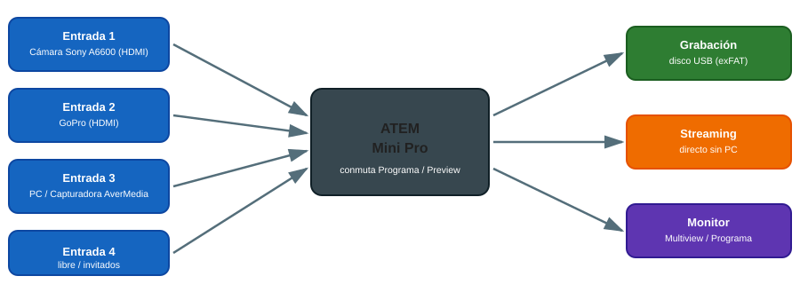

# 🎥 Vídeo y Streaming

> Equipo del Aula ATECA para grabación, producción multicámara y emisión en directo: capturadora AverMedia, cámara Sony A6600, GoPro y switcher ATEM Mini Pro, junto con el software de edición/streaming.

## Esquema de conexiones (producción multicámara)

{ width="800" }

El ATEM Mini Pro es el centro de la producción: recibe hasta 4 fuentes HDMI y reparte la salida a grabación, streaming y monitor, sin necesidad de un PC intermedio.

## 1. Capturadora AverMedia Live Lite

Dispositivo de captura de vídeo por USB 2.0 para grabar/transmitir desde consolas, cámaras o PC en hasta 1080p a 60 fps, sin retardo perceptible.

### 1.1 Uso básico

1. Conecta la fuente (consola, cámara con salida HDMI) a la entrada de la capturadora y la capturadora al PC por USB.
2. Abre OBS (u otro software) y añade una fuente **Dispositivo de captura de vídeo**, seleccionando la AverMedia como origen.
3. Comprueba resolución y fps en las propiedades de la fuente antes de grabar/emitir.

## 2. Cámara Sony A6600

Cámara sin espejo con sensor APS-C de 24.2 MP, autoenfoque rápido, grabación 4K, estabilización de imagen y pantalla táctil abatible. Ideal como cámara principal en producciones de vídeo del centro.

### 2.1 Uso básico

- Para streaming/captura en directo, conéctala al PC o al ATEM vía HDMI **a través de la capturadora AverMedia** si el destino es un PC (la mayoría de cámaras no permiten salida limpia por USB directo).
- Activa el modo "salida HDMI limpia" en el menú de la cámara si está disponible, para no grabar los indicadores en pantalla.
- Usa un trípode o estabilizador para grabaciones largas (evita el apagado automático por inactividad: desactívalo en ajustes de energía).
- Para producciones largas (más de 20-30 min), conecta la cámara a corriente eléctrica: la batería no aguanta una sesión completa en modo streaming continuo.

## 3. GoPro

Cámara de acción compacta y resistente (grabación 4K, resistente al agua sin carcasa, gran angular), pensada para grabaciones en movimiento o en exteriores (talleres, prácticas, deportes).

### 3.1 Uso básico

- Descarga los clips con **GoPro Player** para revisarlos y hacer una primera selección antes de editar.
- Para planos estables, activa la estabilización de imagen (HyperSmooth) en los ajustes de vídeo.
- Aprovecha el control por voz para empezar/parar grabación con las manos ocupadas (talleres, prácticas).

## 4. ATEM Mini Pro (switcher de vídeo)

Mezclador compacto para producciones multicámara en directo: permite conmutar entre varias fuentes HDMI con transiciones fluidas, grabar directamente en un disco USB y emitir en streaming sin necesidad de PC.

### 4.1 Uso básico

1. Conecta hasta 4 fuentes HDMI (cámaras, PC, capturadora) a las entradas del ATEM, tal y como se ve en el esquema de arriba.
2. Usa los botones de la fila superior para elegir la fuente en **Programa** (lo que se emite/graba) y la fila inferior para preparar la **Vista previa**.
3. Aplica transiciones (corte o mezcla) con los controles centrales.
4. Para grabar, conecta un disco USB formateado en **exFAT** y pulsa **Record**.
5. Para producciones avanzadas, instala el software gratuito **ATEM Software Control** en el PC y gestiona el switcher desde allí (overlays, control remoto de cámaras compatibles, audio).

### 4.2 Errores frecuentes

| Problema | Causa habitual | Solución |
|---|---|---|
| No se detecta una entrada | Cable HDMI defectuoso o resolución no soportada | Probar otro cable; ajustar la cámara a 1080p60 |
| El USB no graba | Disco formateado en NTFS/FAT32 | Reformatear el disco en exFAT desde el propio ATEM |
| Streaming se corta | Red Wi-Fi inestable | Conectar el ATEM por cable Ethernet, no por Wi-Fi |

## 📚 Software de edición y streaming

- [OBS Studio](https://obsproject.com/es){target="_blank"} — Streaming y grabación en PC. **Manual completo disponible** en la sección Ateca de esta misma web: [OBS Studio](obs.md) (instalación, escenas, fuentes, audio, atajos y plugins).
- [OpenShot](https://www.openshot.org/es){target="_blank"} — Edición de vídeo libre y sencilla, ideal para montajes rápidos del alumnado.
- [GoLightStream](https://golightstream.com){target="_blank"} — Streaming online multiplataforma.
- [Touch Portal](https://www.touch-portal.com){target="_blank"} — Convierte una tablet en Stream Deck (control remoto de escenas/atajos).
- [GoPro Player](https://apps.microsoft.com/store/detail/gopro-player-reelsteady/9MW2BVRCG0B2?hl=es-co&gl=co){target="_blank"} — Reproducción y estabilización de clips GoPro.

## 📚 Recursos

- 🌐 Web del Aula ATECA (fuente de este manual): [Tecnologías | Aula AtecA](https://www3.gobiernodecanarias.org/medusa/proyecto/35014664-0006/aplicaciones/){target="_blank"}
- 📖 [Manual de ATEM Software Control (Blackmagic)](https://www.blackmagicdesign.com/es/support/){target="_blank"}

> 📷 **Pendiente:** añadir fotos reales del set de vídeo del aula (chroma, cámaras montadas, mesa del ATEM) y una captura del software ATEM Software Control en uso.
