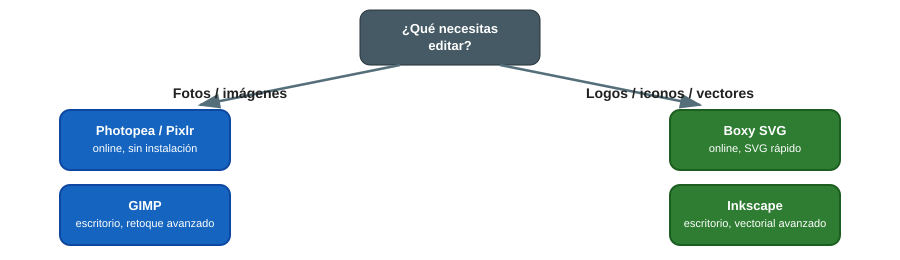

# 🖼️ Edición de Imagen e Impresión

> El Aula ATECA no dispone de hardware específico en esta categoría; el valor está en el software (online y de escritorio) para retoque fotográfico, diseño vectorial y preparación de artes finales para impresión.

## ¿Qué herramienta uso? (guía rápida)

{ width="800" }

## 1. Software online (sin instalación)

### Photopea

Editor de imagen tipo Photoshop que funciona **directamente en el navegador**, compatible con archivos `.psd`, `.ai`, `.xd` y `.sketch`. Ideal para aulas sin permisos de instalación de software.

1. Abre [photopea.com](https://www.photopea.com){target="_blank"}, arrastra la imagen o crea un lienzo nuevo.
2. Interfaz por capas casi idéntica a Photoshop: útil para transición a herramientas profesionales.
3. Guarda tu trabajo con **Archivo → Guardar como PSD** para poder retomarlo más tarde (el navegador no guarda automáticamente).

### Pixlr

Editor online más sencillo que Photopea, con herramientas de IA (recorte automático, generación de fondo) y plantillas listas para redes sociales.

- [pixlr.com](https://pixlr.com/es){target="_blank"}

### Boxy SVG

Editor vectorial online centrado en SVG, útil para preparar logos y trazados que luego se laminan para corte/grabado o se importan como vectores en diseño 3D.

- [boxy-svg.com](https://boxy-svg.com/app){target="_blank"}

## 2. Software de escritorio

### GIMP (edición rasterizada)

Alternativa libre y gratuita a Photoshop, completa para retoque fotográfico, composición por capas y exportación en múltiples formatos.

- [gimp.org](https://www.gimp.org){target="_blank"}
- Uso recomendado: retoque de fotografías para la web del centro, carteles, materiales de proyectos de innovación.
- Formato de trabajo nativo: `.xcf` (guarda capas y ajustes); exporta a `.png`/`.jpg` solo al finalizar.

### Inkscape (diseño vectorial)

Alternativa libre y gratuita a Illustrator, para logotipos, ilustraciones e infografías vectoriales.

- [inkscape.org](https://inkscape.org/es){target="_blank"}
- Uso recomendado: preparación de archivos vectoriales para corte láser/vinilo o para acompañar diseños 3D (grabados, etiquetas).
- Formato de trabajo nativo: `.svg` (escalable sin pérdida de calidad, ideal para logotipos que se usarán en varios tamaños).

## 3. Buenas prácticas en el aula

- Prioriza las herramientas **online** (Photopea, Pixlr, Boxy SVG) en equipos sin privilegios de instalación.
- Exporta siempre en un formato editable (`.xcf`, `.svg`, `.psd`) además del formato final (`.png`, `.jpg`, `.pdf`) para poder retocar el trabajo más adelante.
- Para impresión física, exporta a **PDF** con sangrado si el diseño va a imprenta, o a **PNG** a la resolución final (mínimo 300 ppp) si es para pantalla/web usa 72-150 ppp.
- Nombra los archivos con la fecha y el proyecto (`20260706-cartel-jornada-ateca.svg`) para que cualquier compañero/a pueda encontrarlos y reutilizarlos.

## 📚 Recursos

- 📖 [Tutoriales oficiales de GIMP](https://docs.gimp.org/){target="_blank"}
- 📖 [Manual de Inkscape en español](https://inkscape.org/es/learn/){target="_blank"}
- 🌐 Web del Aula ATECA (fuente de este manual): [Tecnologías | Aula AtecA](https://www3.gobiernodecanarias.org/medusa/proyecto/35014664-0006/aplicaciones/){target="_blank"}

> 📷 **Pendiente:** añadir capturas de pantalla propias de un proyecto editado en GIMP/Inkscape/Photopea por el alumnado del centro.
