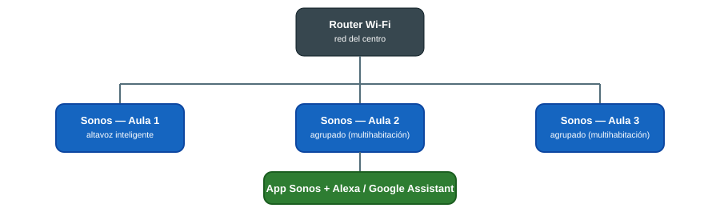

# 🏠 Domótica y Automatización

> El Aula ATECA incorpora altavoces inteligentes **Sonos** como base para prácticas de domótica y automatización del hogar: audio en red, control por voz e integración multihabitación.

## Topología de red del sistema Sonos

{ width="800" }

Todos los altavoces se conectan a la misma red Wi-Fi del centro y se agrupan entre sí; el control se hace desde la app Sonos o por voz mediante Alexa/Google Assistant.

## 1. Altavoces inteligentes Sonos

Sistema de altavoces con conectividad inalámbrica (Wi-Fi), control por voz mediante asistentes como **Alexa** y **Google Assistant**, e integración con múltiples plataformas de streaming de música.

### 1.1 Puesta en marcha

1. Instala la app **Sonos** (móvil/tablet) y crea o accede al sistema del aula.
2. Conecta el altavoz a la red Wi-Fi del centro siguiendo el asistente de la app.
3. Vincula el servicio de streaming de música que se vaya a usar (Spotify, Apple Music, etc.) desde la propia app.
4. Si vas a trabajar control por voz, activa la integración con Alexa o Google Assistant desde **Ajustes del sistema → Servicios de voz**.
5. Para agrupar varios altavoces en modo multihabitación, ve a **Ajustes → Sistema → Agrupar altavoces** y selecciona las aulas/espacios que deben sonar de forma sincronizada.

### 1.2 Posibilidades didácticas

- **Audio multihabitación**: agrupa varios altavoces Sonos en distintas aulas/espacios para que reproduzcan el mismo contenido sincronizado (útil en eventos o jornadas de puertas abiertas).
- **Automatización básica**: combinar el altavoz con rutinas de asistente de voz (ej. "buenos días" que enciende música + otros dispositivos domóticos compatibles) para prácticas de IoT/domótica.
- **Integración con otros sistemas**: los Sonos son compatibles con plataformas de automatización más amplias (por ejemplo, a través de IFTTT o de un hub domótico), lo que permite ampliar la práctica a escenarios con luces, enchufes inteligentes o sensores si el centro incorpora ese equipamiento en el futuro.

### 1.3 Buenas prácticas en el aula

- Usa una cuenta de sistema única para el aula (no cuentas personales del profesorado) para que cualquier docente pueda gestionar el equipo.
- Comprueba la red Wi-Fi antes de la sesión: los Sonos necesitan una conexión estable para agruparse y para el control por voz.
- Si un altavoz "desaparece" de la app, suele bastar con reiniciarlo (mantener pulsado el botón de encendido 10 segundos) y esperar a que vuelva a conectarse a la red.

## 📚 Recursos

- 📖 [Soporte oficial Sonos](https://support.sonos.com/es-es){target="_blank"}
- 📖 [Guía de agrupación de altavoces Sonos](https://support.sonos.com/es-es/article/group-and-ungroup-speakers){target="_blank"}
- 🌐 Web del Aula ATECA (fuente de este manual): [Tecnologías | Aula AtecA](https://www3.gobiernodecanarias.org/medusa/proyecto/35014664-0006/aplicaciones/){target="_blank"}

> 📷 **Pendiente:** añadir fotos reales de los altavoces Sonos instalados en el aula y de la app de control en uso.
