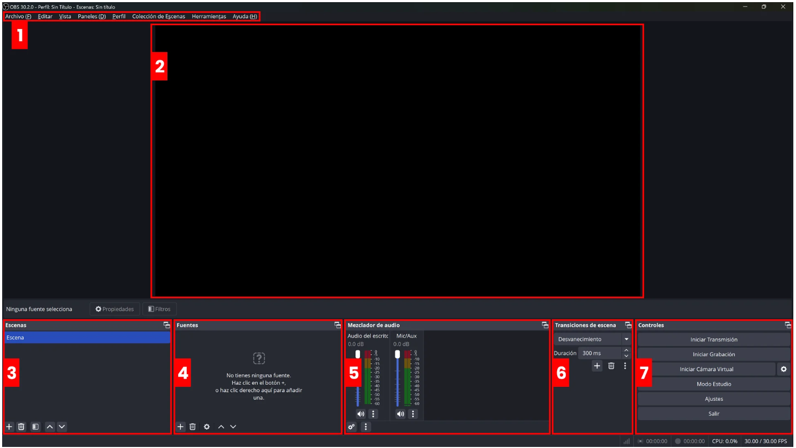
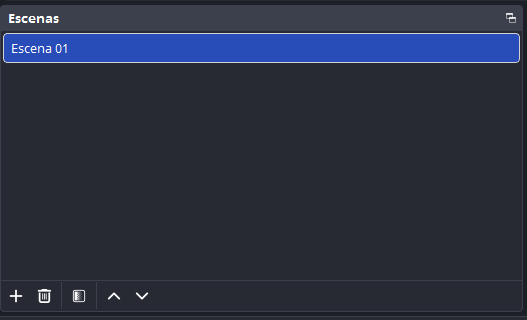
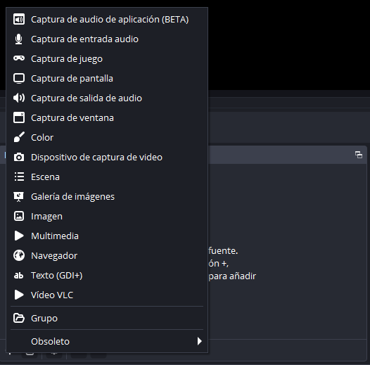
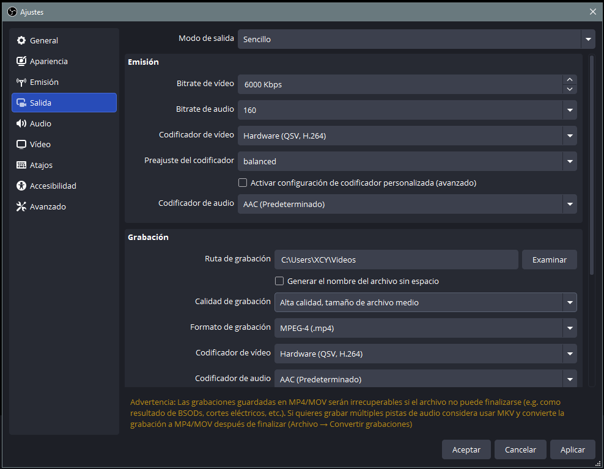
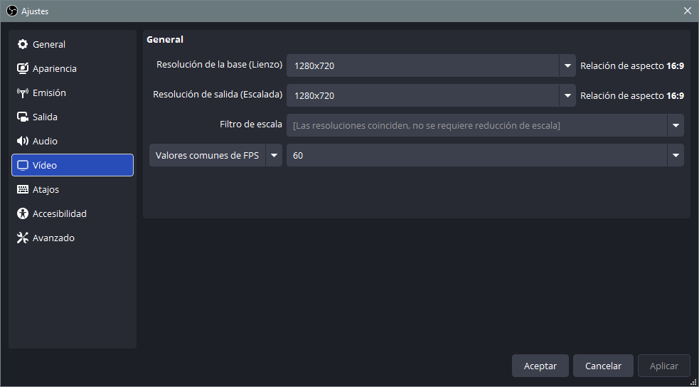
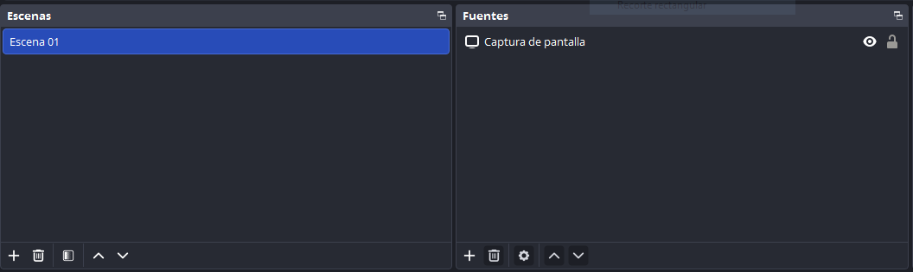
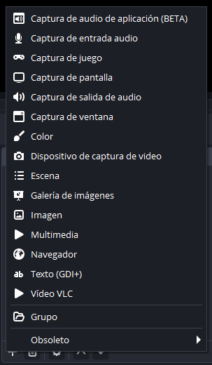
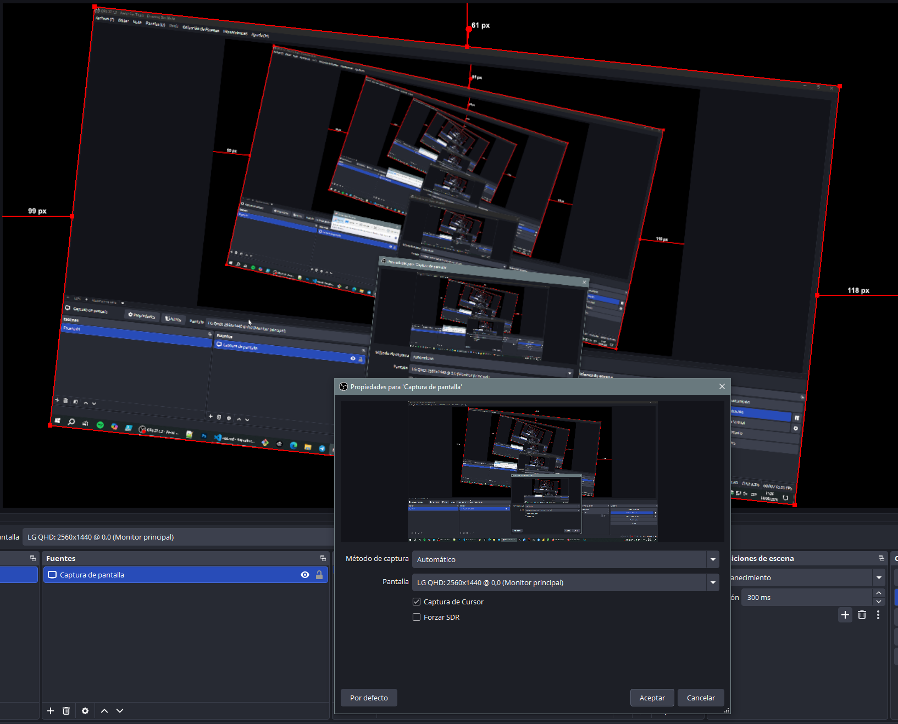
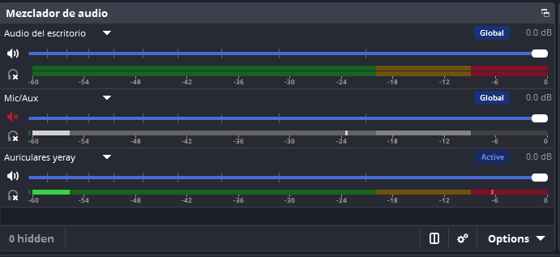

# 🎬 OBS Studio
> **OBS Studio** (Open Broadcaster Software) es software libre, gratuito y de código abierto para grabación de vídeo y retransmisión en directo, considerado el estándar de la industria entre creadores de contenido y streamers.

## 1. Instalar OBS
Descarga desde [obsproject.com](https://obsproject.com){target="_blank"} → instala → al abrirlo por primera vez el **Asistente de configuración automática** te preguntará si quieres optimizar para *streaming* o *grabación*. **Déjalo hacer su trabajo.**

{ width="700" }

1. **Barra de Menús** para configurar distintos aspectos del programa.
2. **Lienzo** La pantalla grande de previsualización en tiempo real. Lo que aparece ahí es exactamente lo que saldrá en tu vídeo. Puedes arrastrar y redimensionar las fuentes directamente sobre él.
3. **Escenas** Una "pantalla" completa con su propio conjunto de fuentes. Puedes tener varias y cambiar entre ellas.
4. **Fuentes** Cada elemento dentro de una escena: pantalla, webcam, imagen, texto, audio...
5. **Mezclador de Audio** Panel donde controlas los niveles de cada fuente de sonido.
6. **Transiciones**  Efecto visual al cambiar de una escena a otra (corte, fundido, etc.).
7. **Controles** Panel con los botones principales: iniciar/parar streaming y grabación, modo estudio, y acceso a configuración.

## 2. Configuración básica
Una vez instalado, debemos comenzar con la configuración, para ello, iremos a **Menú > Archivo > Ajustes** e iremos configurando los diferentes apartados.

### Configurar emisión
En el apartado **Emisión** dentro de los Ajustes, puedes seleccionar tu plataforma de streaming desde el menú desplegable Servicio para vincularla automáticamente (mediante Conectar Cuenta) o configurarla de forma manual (usando la Clave de Emisión). Al elegir una plataforma, se habilitarán opciones adicionales, siendo fundamental marcar la casilla para ignorar las recomendaciones del servicio si tu intención es aplicar tus propios parámetros de transmisión personalizados más adelante.

{ width="700" }

### Configurar salida
Para ajustar rápidamente la calidad de tus directos y vídeos, ve a la pestaña Salida y selecciona el modo Sencillo. Desde ahí, puedes configurar dos bloques principales:

- **Transmisión (Streaming)**: Aquí limitas el uso de tu red ajustando el Bitrate de Vídeo (para emitir a 1080p se sugiere entre 2500 y 5000 Kbps, aunque es ideal consultar las recomendaciones exactas de la plataforma que vayas a usar). Asegúrate de que el Bitrate de Audio esté al menos a 128 Kbps y, por lo general, es mejor dejar los codificadores en sus valores predeterminados.
- **Grabación Local**: Primero, elige la carpeta de tu PC donde se guardarán los vídeos. Luego, configura la calidad en "Alta" (que genera un tamaño de archivo medio) y selecciona el formato MP4 fragmentado. Para el vídeo, si tienes una tarjeta gráfica dedicada, elige la codificación por Hardware; para el audio, puedes dejar la opción AAC por defecto.

> Nota: Esta guía utiliza los ajustes básicos. Si tienes conocimientos técnicos sobre formatos y códecs, siempre puedes explorar la pestaña de opciones Avanzadas para tener un control total.

{ width="700" }

### Configurar Audio
A continuación, dirígete a la pestaña Audio para establecer cómo se escuchará tu transmisión o grabación:

- **Configuración General**: Define la frecuencia de muestreo (puedes elegir entre 44.1 kHz o 48 kHz) y asegúrate de que la opción de canales esté marcada como Estéreo.
- **Dispositivos de Audio Globales**: Este apartado controla los sonidos que se escucharán en todas tus escenas de forma general. Configura el Audio del Escritorio con su valor por defecto para capturar el sonido de tu ordenador, y en Mic/Auxiliar selecciona el micrófono que vayas a utilizar (interno, USB, etc.).

> ¡Importante! Si prefieres tener un control más detallado y añadir el audio manualmente solo en escenas específicas, debes dejar todos estos dispositivos globales en Deshabilitado.

{ width="700" }

### Configurar Vídeo 
Para terminar la configuración básica, entra en la pestaña Vídeo, que es donde ajustarás el tamaño visual de tu transmisión o grabación:

- **Resoluciones**: Te sugerimos establecer tanto la Resolución de base (el lienzo donde organizas tus elementos) como la Resolución de salida (la imagen final que se emite o graba) en 1920x1080 (Full HD).
- **Filtro de Escala**: Al poner ambas resoluciones con los mismos valores, este ajuste se ocultará automáticamente. Si por algún motivo necesitas usar resoluciones distintas, la opción más recomendable para mantener una buena nitidez es Lanczos.
- **Fotogramas por Segundo (FPS)**: Ajusta este valor según tus necesidades. Ten en cuenta que 30 FPS es el estándar más seguro y compatible para el rendimiento general de las redes y las cámaras web.

{ width="700" }

## 3. Escenas
La estructura de OBS se basa en **Escenas**, las cuales funcionan como carpetas o contenedores que agrupan diferentes **Fuentes** (como cámaras, capturas de pantalla, audios o textos). Al activar una escena, se mostrarán todos los elementos que hayas metido en ella, respetando la ``posición y el orden de capas`` que hayas configurado. Al iniciar el programa, encontrarás una escena en blanco de forma predeterminada. Puedes administrar tu lista de escenas desde su panel inferior con los siguientes controles:

- **Añadir y eliminar**: Usa el botón + para crear una nueva escena o el icono de la papelera para borrarla.
- **Organizar**: Utiliza las flechas para ordenar la lista a tu gusto.
- **Modificar**: Si haces clic derecho sobre cualquier escena, se abrirá un menú para cambiarle el nombre o duplicarla.

{ width="700" }

## 4. Fuentes
Para meter contenido visual o interno dentro de la escena seleccionada, haz clic en el botón + del panel de Fuentes. El sistema te permite integrar una gran variedad de recursos:

- **Elementos disponibles**: 
    - `Captura de pantalla` | Captura todo el monitor
    - `Captura de ventana` | Solo una aplicación concreta 
    - `Dispositivo de captura de vídeo` | Webcam 
    - `Fuente multimedia` | Vídeo/audio de un archivo 
    - `Texto (GDI+)` | Añadir texto sobre la escena 
    - `Imagen` | Logos, overlays, marcos 
    - `Captura del juego` | Modo optimizado para videojuegos 
- **Personalización**: Al añadir cualquier fuente, se abrirá un menú específico para darle un nombre propio y ajustar sus parámetros iniciales.
- Herramientas de control en el lienzo:
    - **Ojo y Candado**: El icono del ojo te permite ocultar o mostrar una fuente rápidamente, mientras que el candado la bloquea para evitar que la muevas o modifiques por error.
    - **Agrupación y anidación**: Puedes juntar varias fuentes en "Grupos" para gestionarlas como si fueran un solo elemento, o incluso importar una escena completa dentro de otra para crear composiciones avanzadas.

{width="500"}

## 5. Lienzo y Efectos
La pantalla principal o Lienzo es tu espacio de trabajo para transformar las fuentes de manera visual:

- **Manipulación directa**: Al hacer clic sobre cualquier elemento verás un borde rojo. Puedes arrastrarlo para moverlo o usar atajos rápidos: mantén presionado Mayús para deformar su tamaño libremente o Alt para recortar los bordes de la imagen.
- **Duplicar con cuidado**: Puedes copiar y pegar elementos con Ctrl + C y Ctrl + V, pero evita hacerlo entre escenas distintas. Si lo haces de forma clásica, se pegará como una referencia vinculada (lo que alteres en una escena cambiará automáticamente en la otra). Es mejor añadir la fuente desde cero o usar la opción Pegar como duplicado con el clic derecho.
- **Filtros visuales**: Al hacer clic derecho sobre una fuente, grupo o escena y seleccionar Filtros, puedes añadir efectos cromáticos o de vídeo mediante el botón +.

{width="500"}

## 6. Audio
El Mezclador de audio reúne todas las señales sonoras de tu transmisión, agrupando los sonidos globales del sistema y micrófonos junto a los elementos multimedia independientes.

- **Control básico**: Modifica los volúmenes con las barras deslizantes azules y silencia canales usando el icono del altavoz. Ten en cuenta que, por defecto, todo se unificará en una sola pista estéreo en la salida final.
- **Sincronización de desfases**: Si notas que tu voz no va a la par con tu cámara, haz una prueba dando un par de palmadas. Después, ve al engranaje del panel, entra en Propiedades de audio avanzadas y ajusta el Intervalo de sincronización sumando milisegundos (un retraso habitual suele estar entre los 200 y 300 ms). Este ajuste se debe hacer por separado para cada dispositivo desalineado.
- **Escucharse a uno mismo (Monitorización)**: Para evitar bucles de eco molestos, OBS no reproduce el sonido capturado en tus propios auriculares de forma nativa. Si necesitas escuchar una fuente en tiempo real, entra a las Propiedades de audio avanzadas y cambia su estado a Monitorización y salida.

{width="300"}

## 7. Transiciones
Al cambiar entre tus escenas se ejecutará el efecto visual que hayas puesto por defecto (como cortes o desvanecimientos) junto con el tiempo de duración que le asignes.

- **Transiciones personalizadas**: Si quieres que una escena específica tenga un efecto de entrada único, haz clic derecho sobre ella y selecciona Anulación de transición. También puedes añadir estos efectos a las fuentes individuales cuando las ocultas o muestras con el icono del ojo.

## 8. Atajos
Para que tu producción sea mucho más fluida e intuitiva, entra en Ajustes > Atajos y asigna combinaciones de teclas para saltar de escena o apagar fuentes al instante.
    - **Bloquear fuentes** — clic derecho sobre una fuente → `Bloquear` para que no la muevas sin querer.
    - **Orden de fuentes importa** — las fuentes de arriba tapan a las de abajo (como capas en Photoshop).
    - **Previsualización** — lo que ves en el canvas NO es lo que se graba hasta que das a grabar. Usa `Estudio` para ver ambas cosas a la vez.
    - **Modo Estudio** — botón abajo a la derecha, permite preparar la siguiente escena antes de cambiar.
    - **Filtros de vídeo** — clic derecho en una fuente → `Filtros` → puedes añadir corrección de color, máscara, recorte, etc.
    - Ve a `Configuración → Atajos de teclado` y asigna teclas a las acciones que más uses. Por ejemplo: Iniciar/parar grabación, Iniciar/parar streaming, Silenciar micrófono, Cambiar de escena 

## 9. Grabar y emitir
- 📁 **Grabación en Local**: Al pulsar Iniciar grabación en el panel de controles, todo lo que ocurra en el lienzo se guardará directamente en tu ordenador. Sé cuidadoso, ya que los fallos en vivo se registrarán en el vídeo final.
- 🎥 **Cámara Virtual**: Puedes usar la composición de OBS como si fuera tu webcam en aplicaciones como Zoom o Teams pulsando Iniciar cámara virtual. Desde su engranaje puedes elegir si transmitir todo el proyecto o solo una escena en concreto. Importante: Esta función solo envía vídeo; el audio de OBS no se transfiere a la videollamada, por lo que deberás seleccionar tu micrófono directamente en los ajustes de Zoom/Teams.
- 🌐 **Emisión en Directo** (Streaming): El botón Iniciar transmisión envía tu señal directamente a la plataforma configurada. Para hacer cambios sobre la marcha sin que tu audiencia lo note, activa el Modo estudio. Esto dividirá la interfaz en dos pantallas: Vista previa (donde editas y preparas cosas a ciegas) y Programa (lo que se está emitiendo en vivo). Cuando termines de ajustar, usas los controles centrales para aplicar el cambio.

> - 💡 Graba en **MKV** y convierte a MP4 después con `Archivo → Remuxear grabaciones`. Si OBS se cierra inesperadamente, el MKV se puede recuperar; el MP4 no.

```
Resolución base:      1920x1080
Resolución de salida: 1920x1080
FPS:                  30 (o 60 si tu PC lo soporta)
Codificador:          x264 (o NVENC si tienes Nvidia)
Tasa de bits:         6000-8000 kbps (para alta calidad)
Formato archivo:   MKV (más seguro ante cortes de luz) → luego remuxear a MP4
```
## 10. Perfil
> - Puedes crear un **Perfil**: Configuración de salida guardada (útil para tener uno para streaming y otro para grabación).


## 11. Plugins
Se presentan los **plugins más útiles** para potenciar OBS más allá de sus funciones nativas:

- **obs-move-transition:** transiciones fluidas y animadas entre elementos de la escena.
- **StreamFX:** efectos visuales avanzados como blur, sombras, shaders 3D.
- **Advanced Scene Switcher:** automatización del cambio de escenas según condiciones (ventana activa, tiempo, etc.).
- **Source Clone:** duplicar fuentes sin consumir recursos adicionales.
- **Virtualcam:** usar OBS como cámara virtual en Zoom, Meet, Teams, etc.
- **obs-websocket:** controlar OBS de forma remota desde aplicaciones externas o streamdecks.
- **Elgato Stream Deck integration:** asignar acciones de OBS a botones físicos o de pantalla táctil.

## 📚 Recursos

- 📖 Documentación oficial: [obsproject.com/wiki](https://obsproject.com/wiki){target="_blank"}
- 💬 Foro oficial: [obsproject.com/forum](https://obsproject.com/forum){target="_blank"}
- 🎥 Canal YouTube recomendado: busca **"OBS Studio tutorial español"**
- ▶︎ [Curso de OBS Studio- Youtube](https://youtu.be/LXlabyl7kS4){target="_blank"}
- 00:01:11

