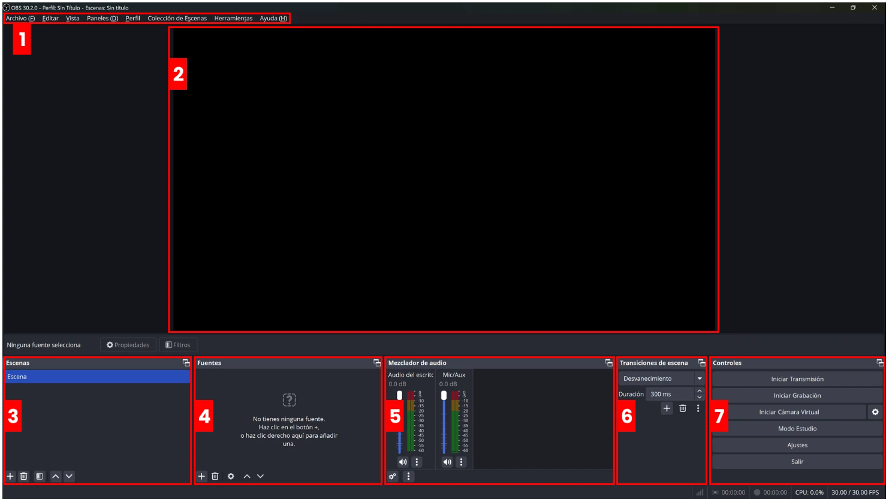

# 🎬 OBS Studio
> **OBS Studio** (Open Broadcaster Software) es software libre, gratuito y de código abierto para grabación de vídeo y retransmisión en directo, considerado el estándar de la industria entre creadores de contenido y streamers.

## 1. Instalar OBS
Descarga desde [obsproject.com](https://obsproject.com){target="_blank"} → instala → al abrirlo por primera vez el **Asistente de configuración automática** te preguntará si quieres optimizar para *streaming* o *grabación*. **Déjalo hacer su trabajo.**

{ width="900" }

1. **Barra de Menús** para configurar distintos aspectos del programa.
2. **Lienzo** La pantalla grande de previsualización en tiempo real. Lo que aparece ahí es exactamente lo que saldrá en tu vídeo. Puedes arrastrar y redimensionar las fuentes directamente sobre él.
3. **Escenas** Una "pantalla" completa con su propio conjunto de fuentes. Puedes tener varias y cambiar entre ellas.
4. **Fuentes** Cada elemento dentro de una escena: pantalla, webcam, imagen, texto, audio...
5. **Mezclador de Audio** Panel donde controlas los niveles de cada fuente de sonido.
6. **Transiciones**  Efecto visual al cambiar de una escena a otra (corte, fundido, etc.).
7. **Controles** Panel con los botones principales: iniciar/parar streaming y grabación, modo estudio, y acceso a configuración.

## 2. Configuración básicas
Una vez instalado, debemos comenzar con la configuración, para ello, iremos a **Menú > Archivo > Ajustes** e iremos configurando los diferentes apartados.

### Configurar emisión
En el apartado **Emisión** dentro de los Ajustes, puedes seleccionar tu plataforma de streaming desde el menú desplegable Servicio para vincularla automáticamente (mediante Conectar Cuenta) o configurarla de forma manual (usando la Clave de Emisión). Al elegir una plataforma, se habilitarán opciones adicionales, siendo fundamental marcar la casilla para ignorar las recomendaciones del servicio si tu intención es aplicar tus propios parámetros de transmisión personalizados más adelante.

### Configurar salida
Para ajustar rápidamente la calidad de tus directos y vídeos, ve a la pestaña Salida y selecciona el modo Sencillo. Desde ahí, puedes configurar dos bloques principales:

  -  Transmisión (Streaming): Aquí limitas el uso de tu red ajustando el Bitrate de Vídeo (para emitir a 1080p se sugiere entre 2500 y 5000 Kbps, aunque es ideal consultar las recomendaciones exactas de la plataforma que vayas a usar). Asegúrate de que el Bitrate de Audio esté al menos a 128 Kbps y, por lo general, es mejor dejar los codificadores en sus valores predeterminados.

  -  Grabación Local: Primero, elige la carpeta de tu PC donde se guardarán los vídeos. Luego, configura la calidad en "Alta" (que genera un tamaño de archivo medio) y selecciona el formato MP4 fragmentado. Para el vídeo, si tienes una tarjeta gráfica dedicada, elige la codificación por Hardware; para el audio, puedes dejar la opción AAC por defecto.

Nota: Esta guía utiliza los ajustes básicos. Si tienes conocimientos técnicos sobre formatos y códecs, siempre puedes explorar la pestaña de opciones Avanzadas para tener un control total.


### Configurar Audio
### Configurar Vídeo 


## Primeros pasos

| Concepto | Qué es |
|---|---|
| **Perfil** | Configuración de salida guardada (útil para tener uno para streaming y otro para grabación). |


### 2. Crear tu primera escena
En el panel **Escenas** → clic en `+` y dar un nombre descriptivo, ej: `Escena 01`


### 3. Añadir fuentes a la escena
En el panel **Fuentes** → clic en `+` y elegir el tipo:


- `Captura de pantalla` | Captura todo el monitor
- `Captura de ventana` | Solo una aplicación concreta 
- `Dispositivo de captura de vídeo` | Webcam 
- `Fuente multimedia` | Vídeo/audio de un archivo 
- `Texto (GDI+)` | Añadir texto sobre la escena 
- `Imagen` | Logos, overlays, marcos 
- `Captura del juego` | Modo optimizado para videojuegos 

### 4. Ajustar audio  y salida
**Audio:**

En **Mezclador de audio** verás tus micrófonos y audio del escritorio. Las barras deben quedarse en **verde/amarillo**, nunca en rojo. Clic en el engranaje ⚙️ de cada canal para filtros (reducción de ruido, compresión, etc.).

**Salida:**

Para configurar la salida vamos a : ``Archivo → Ajustes → sección Salida`` y configuramos:

- ``Modo de salida``: Sencillo 
- ``Codificador de video``: x264 (CPU) o NVENC/AMF si tienes GPU Nvidia/AMD
- ``Ruta de grabación``: Por defecto en la **carpeta de vídeos** del sistema.
- ``Calidad de grabación``: Alta calidad, tamaño de archivo mediano


### 5. Configurar grabación

**🔧 Configuración recomendada para empezar (grabación local)**

```
Resolución base:      1920x1080
Resolución de salida: 1920x1080
FPS:                  30 (o 60 si tu PC lo soporta)
Codificador:          x264 (o NVENC si tienes Nvidia)
Tasa de bits:         6000-8000 kbps (para alta calidad)
Formato archivo:   MKV (más seguro ante cortes de luz) → luego remuxear a MP4
```

> 💡 Graba en **MKV** y convierte a MP4 después con `Archivo → Remuxear grabaciones`. Si OBS se cierra inesperadamente, el MKV se puede recuperar; el MP4 no.

## Trucos y Atajos

- **Bloquear fuentes** — clic derecho sobre una fuente → `Bloquear` para que no la muevas sin querer.
- **Orden de fuentes importa** — las fuentes de arriba tapan a las de abajo (como capas en Photoshop).
- **Previsualización** — lo que ves en el canvas NO es lo que se graba hasta que das a grabar. Usa `Estudio` para ver ambas cosas a la vez.
- **Modo Estudio** — botón abajo a la derecha, permite preparar la siguiente escena antes de cambiar.
- **Filtros de vídeo** — clic derecho en una fuente → `Filtros` → puedes añadir corrección de color, máscara, recorte, etc.
- Ve a `Configuración → Atajos de teclado` y asigna teclas a las acciones que más uses. Por ejemplo: Iniciar/parar grabación, Iniciar/parar streaming, Silenciar micrófono, Cambiar de escena 

## 
## 
##

## Descargar, instalar y configurar OBS 00:01:11 — 

Se explica cómo descargar OBS Studio desde su web oficial ([obsproject.com](https://obsproject.com)) para **Windows, macOS y Linux**. Una vez instalado, se hace un recorrido por la interfaz principal:

- **Panel de escenas** (abajo a la izquierda)
- **Panel de fuentes**
- **Mezclador de audio**
- **Controles** (grabar, transmitir, ajustes)

Se configura el **asistente de configuración automática**, que analiza el hardware del equipo y sugiere los ajustes de vídeo y codificación más adecuados. Se definen parámetros clave como resolución, FPS y codificador (NVENC para NVIDIA o x264 para CPU).

---

## Diseño de escenas, fuentes y transiciones en OBS 00:16:22 — 

Se profundiza en la estructura de trabajo de OBS basada en **escenas y fuentes**:

- **Escenas:** cada pantalla o "layout" distinto que se puede usar durante una grabación o directo (ej: pantalla de inicio, gameplay, cámara principal, pantalla de pausa).
- **Fuentes disponibles:**
  - Captura de pantalla / ventana
  - Captura de juego
  - Dispositivo de vídeo (webcam)
  - Imagen y presentación de imágenes
  - Texto (GDI+)
  - Navegador (para alertas y overlays web)
  - Captura de audio/entrada de audio
- **Transformaciones y filtros de imagen:** recortar, rotar, ajustar opacidad, aplicar chroma key (pantalla verde virtual).
- **Transiciones entre escenas:** corte directo, fundido, deslizamiento, stinger. Se enseña cómo personalizar cada una.

Se muestran buenas prácticas de organización para tener un proyecto limpio y fácil de gestionar en directo.

---

## 00:40:13 — Mejorar el sonido en OBS

El audio es uno de los aspectos más críticos en cualquier producción. En este bloque se explica cómo gestionar y mejorar el sonido dentro de OBS:

- **Mezclador de audio:** control de volumen por pistas, monitoreo y silenciado.
- **Filtros de audio** aplicables a cada fuente de sonido:
  - **Puerta de ruido:** elimina el ruido de fondo cuando no se habla.
  - **Compresor:** nivela el volumen para evitar picos altos.
  - **Limitador:** protege contra saturaciones.
  - **Ganancia:** sube o baja el nivel de la señal.
  - **VST (plugins externos):** permite integrar efectos de terceros.
- Configuración del **micrófono** y cómo diferenciarlo del sonido del escritorio.
- Grabación en **pistas de audio separadas** para mayor flexibilidad en postproducción.

---

## 00:54:16 — Grabar en local en OBS

Se detalla todo el proceso para realizar **grabaciones de pantalla de alta calidad** guardadas en el disco local:

- **Formatos de salida recomendados:** MKV (más seguro ante cortes), MP4, MOV.
- **Codificadores de vídeo:** NVENC (GPU NVIDIA), AMF (GPU AMD), QuickSync (Intel) o x264 (CPU). Se comparan calidad y consumo de recursos.
- **Tasa de bits (bitrate):** cómo ajustarla según el uso (tutoriales, gameplay, cursos).
- **Buffer de repetición:** función para capturar los últimos segundos de juego sin necesidad de grabar todo el tiempo.
- **Rutas de guardado y nomenclatura** de archivos automáticos.
- Consejos para evitar caídas de rendimiento durante la grabación (prioridad de proceso, ajuste de presets de codificación).

---

## 01:09:19 — Emitir en streaming con OBS

Bloque dedicado a la **retransmisión en directo**. Se explica el proceso completo para conectar OBS con las principales plataformas:

- **YouTube Live, Twitch, Facebook Gaming:** configuración mediante clave de retransmisión o conexión directa con la cuenta.
- **Ajustes recomendados de streaming:**
  - Bitrate de vídeo según velocidad de subida del internet.
  - Resolución y FPS según la plataforma (1080p60 para Twitch/YouTube, 720p30 para conexiones más lentas).
- **Multistreaming:** emitir simultáneamente a varias plataformas.
- **Modo estudio:** permite editar escenas sin que la audiencia lo vea antes de hacer el cambio.
- **Estadísticas en tiempo real:** latencia, frames perdidos, uso de CPU/GPU durante el directo.
- Integración con **overlays y alertas** (nuevos seguidores, donaciones) mediante fuentes de tipo navegador.

---

## 01:54:32 — Plugins, extensiones y complementos para OBS

Una de las secciones más avanzadas y completas del curso. Se presentan los **plugins más útiles** para potenciar OBS más allá de sus funciones nativas:

- **obs-move-transition:** transiciones fluidas y animadas entre elementos de la escena.
- **StreamFX:** efectos visuales avanzados como blur, sombras, shaders 3D.
- **Advanced Scene Switcher:** automatización del cambio de escenas según condiciones (ventana activa, tiempo, etc.).
- **Source Clone:** duplicar fuentes sin consumir recursos adicionales.
- **Virtualcam:** usar OBS como cámara virtual en Zoom, Meet, Teams, etc.
- **obs-websocket:** controlar OBS de forma remota desde aplicaciones externas o streamdecks.
- **Elgato Stream Deck integration:** asignar acciones de OBS a botones físicos o de pantalla táctil.
- Se explica cómo **instalar plugins manualmente** y desde el gestor de plugins integrado en OBS.

---

## 03:07:14 — Final del curso

Cierre del curso con un repaso de todo lo aprendido: desde la instalación básica hasta el uso de plugins avanzados. El instructor anima a practicar, experimentar con los ajustes y personalizar OBS según las necesidades de cada proyecto. Se ofrecen recursos adicionales y se invita a la comunidad a compartir sus producciones y preguntas. Se recuerda que OBS Studio es un proyecto de código abierto en constante evolución, por lo que siempre habrá novedades y mejoras que explorar.

---

> 💡 **Consejo final:** La mejor forma de aprender OBS es practicando. Empieza con una grabación sencilla, añade una webcam, configura el audio y ve añadiendo complejidad poco a poco.


## 📚 Recursos

- 📖 Documentación oficial: [obsproject.com/wiki](https://obsproject.com/wiki){target="_blank"}
- 💬 Foro oficial: [obsproject.com/forum](https://obsproject.com/forum){target="_blank"}
- 🎥 Canal YouTube recomendado: busca **"OBS Studio tutorial español"**
- ▶︎ [Curso de OBS Studio- Youtube](https://youtu.be/LXlabyl7kS4){target="_blank"}
- 00:00:00

---

*Generado como punto de partida para el curso de OBS · Actualiza esta hoja conforme avances* 🚀