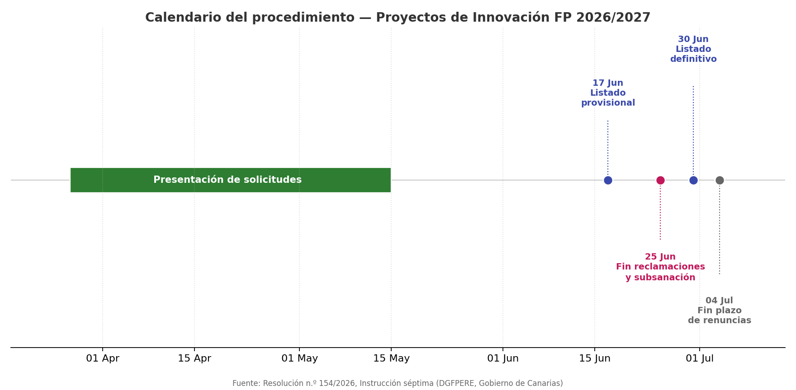
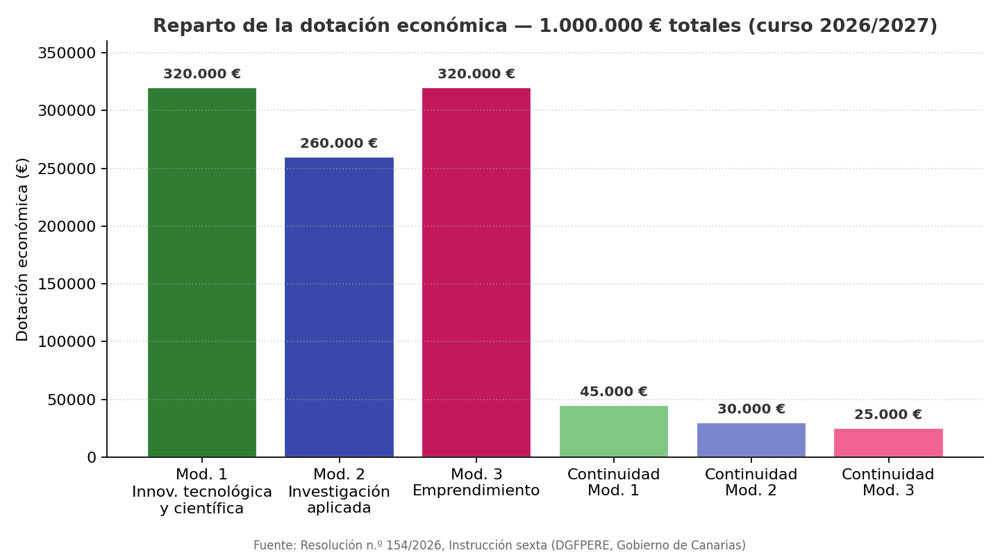
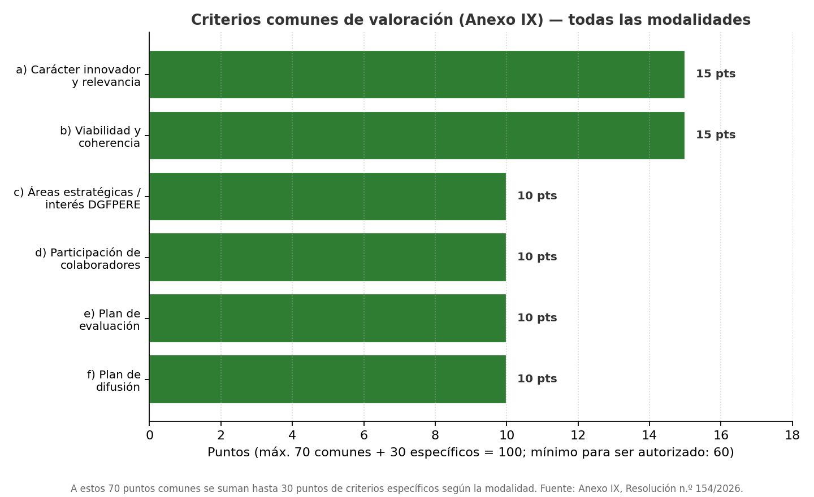

# 🚀 Proyectos de Innovación en FP (Canarias) — Curso 2026/2027

> Página de consulta sobre la convocatoria de **Proyectos de Investigación, Desarrollo e Innovación** en Enseñanzas de Formación Profesional, Enseñanzas Profesionales de Artes Plásticas y Diseño y Enseñanzas Deportivas del Gobierno de Canarias: modalidades, requisitos, calendario, presupuesto y **cómo se puntúan los proyectos**. Basada en la [web oficial de Proyectos de Innovación](https://www.gobiernodecanarias.org/educacion/web/formacion_profesional/programas_proyectos/proyectos_innovacion/index.html) y en la **Resolución n.º 154/2026**, de 27 de marzo, de la Dirección General de Formación Profesional y Enseñanzas de Régimen Especial (DGFPERE).

## 1. ¿Qué es un proyecto de innovación en FP?

Son proyectos capaces de **traducir ideas en oportunidades que añaden valor**, con el objetivo de generar, compartir y movilizar conocimiento entre los centros docentes y las empresas, y que redunden en la formación del alumnado. La convocatoria financia tanto proyectos de **nueva creación** como la **continuidad** de proyectos ya autorizados en el curso 2025/2026, con una dotación total de **1.000.000 €** para el curso 2026/2027.

La gestión de las solicitudes se realiza de forma obligatoria a través del sistema corporativo **HiperReg**, dirigidas a la DGFPERE, con copia de la documentación en PDF a `innova.formacionprofesional@gobiernodecanarias.org`.

## 2. Marco normativo

| Documento | Contenido |
|---|---|
| **Resolución n.º 154/2026** (Tomo 1, Libro 570, 27/03/2026) | Convoca el procedimiento y aprueba las instrucciones (Anexo I) y el resto de anexos (II a XII) |
| Anexo I | Instrucciones completas del procedimiento |
| Anexo II | Solicitud de participación (nueva creación / continuidad) |
| Anexo III | Memoria descriptiva — **proyectos nuevos** (formato ODT) |
| Anexo IV | Memoria descriptiva — **proyectos de continuidad** (formato ODT) |
| Anexo V | Presupuesto del proyecto y justificación |
| Anexo VI | Compromiso de participación de centros colaboradores |
| Anexo VII | Compromiso de participación de empresas/entidades |
| Anexo VIII | Memoria justificativa final (formato ODT) |
| **Anexo IX** | **Criterios de valoración de los proyectos** ← ver [apartado 9](#9-criterios-de-valoración-cómo-se-puntúan-los-proyectos) |
| Anexo X | Renuncia al proyecto |
| Anexo XI / XII | Certificados de participación del profesorado / alumnado |

Toda la documentación oficial y los anexos descargables están en la [página de Proyectos de Innovación de la Consejería](https://www.gobiernodecanarias.org/educacion/web/formacion_profesional/programas_proyectos/proyectos_innovacion/index.html).

## 3. Modalidades de participación

La convocatoria contempla **tres modalidades de nueva creación** y una **modalidad de continuidad** para proyectos ya autorizados.

### 3.1 Modalidad 1 — Innovación tecnológica y científica

Impulsa proyectos innovadores con base tecnológica y científica con incidencia clara en el sector productivo, promoviendo **prototipos de nuevos productos, procesos y/o servicios**, en colaboración con otros centros y empresas.

**Requisitos específicos más relevantes:**

- Máximo de proyectos por centro según número de grupos: **1 proyecto** (hasta 40 grupos) o **2 proyectos** (más de 40 grupos y/o oferta de Grado E).
- Entre 1 y 2 centros colaboradores (Anexo VI).
- Al menos 1 empresa/entidad colaboradora del sector.
- Mínimo 2 familias profesionales o departamentos implicados.
- Máximo 2 docentes coordinadores en centros colaboradores; no puede haber más de un coordinador por centro.
- El resultado debe ser un **producto, proceso o servicio** tecnológico o científico con potencial de impacto.

### 3.2 Modalidad 2 — Investigación aplicada e innovación avanzada

Dirigida a fomentar la **investigación aplicada** para resolver problemas concretos del sector productivo, o a impulsar proyectos de innovación de mayor alcance, complejidad o necesidad de recursos que la Modalidad 1.

**Requisitos específicos más relevantes:**

- **1 proyecto máximo** por centro en esta modalidad.
- Entre 1 y 3 centros colaboradores.
- La empresa/entidad colaboradora debe ser **referente** en el área profesional del proyecto.
- Mínimo 2 familias profesionales o departamentos.
- Hasta 3 docentes coordinadores en centros colaboradores, más un posible segundo coordinador en el centro coordinador.
- Debe seguir una **metodología científica** (hipótesis, recopilación de datos, análisis, objetivos, desarrollo, evaluación y difusión).
- **Obligatorio** incluir en la memoria un **plan de transferencia para un segundo año** (réplica, sostenibilidad e implantación en otros centros o en el sector productivo).

### 3.3 Modalidad 3 — Emprendimiento en el marco de la innovación

Busca fortalecer la relación entre la FP y el mercado laboral, impulsando modelos de negocio con impacto social, económico y medioambiental, y consolidando las **aulas de emprendimiento** como espacios de transformación.

**Requisitos específicos más relevantes:**

- **1 proyecto máximo** por centro.
- Entre 1 y 2 centros colaboradores.
- Al menos 1 empresa/entidad colaboradora que valide y contextualice la propuesta.
- Mínimo 2 familias profesionales, con especial relevancia del **departamento de FOL**.
- El alumnado participa en **todas las fases**, desde la identificación de necesidades hasta la validación.
- El proyecto debe culminar en un **Producto Mínimo Viable (PMV)**: prototipo funcional que demuestre viabilidad técnica, operativa y, en su caso, comercial.
- Debe incluir, de forma integrada: generación de la idea, análisis de contexto/mercado, diseño y desarrollo, definición del modelo de negocio, planificación operativa, viabilidad y estrategia de implementación.

### 3.4 Modalidad de continuidad

Para centros con proyectos autorizados en 2025/2026 que deseen continuar en 2026/2027.

- Solicitud según Anexo II; memoria según **Anexo IV** (no Anexo III).
- Debe justificarse la continuidad: complejidad, tecnologías de vanguardia, tiempo adicional necesario, limitación de recursos previos, e **interés estratégico** para la DGFPERE.
- Entre 1 y 2 centros colaboradores; al menos 1 empresa/entidad colaboradora.
- **No computa** para el límite máximo de proyectos por centro.

## 4. Áreas prioritarias de la convocatoria

Todos los proyectos deben poder vincularse, al menos parcialmente, a alguna de estas áreas:

1. **Transformación digital y tecnologías emergentes**: IA, robótica, automatización, IoT, análisis de datos, blockchain, computación en la nube.
2. **Innovación educativa y recursos tecnológicos para el aprendizaje**: simuladores, plataformas digitales, laboratorios virtuales, entornos inmersivos.
3. **Sectores estratégicos para el desarrollo territorial**: turismo inteligente y sostenible, salud y bienestar, sector primario y agroalimentario, vivienda y construcción sostenible, economía azul y verde, transporte y movilidad sostenible, sector aeroespacial.
4. **Emprendimiento e innovación con impacto económico y social**: iniciativas alineadas con los Objetivos de Desarrollo Sostenible (ODS).
5. **Igualdad, inclusión y reducción de la brecha de género en STEAM**: participación de mujeres en profesiones tecnológicas y científicas, perspectiva de género.

## 5. Requisitos generales de participación (todas las modalidades)

- No haber sido beneficiario de otra financiación para el mismo proyecto.
- La solicitud (Anexo II) la presenta únicamente el **centro coordinador**.
- Memoria descriptiva obligatoria (Anexo III o IV según el caso).
- Colaboración con **uno o varios centros educativos**, con funciones definidas en la memoria.
- El centro coordinador designa una **persona responsable coordinadora**.
- Compromiso de participación de cada centro colaborador (Anexo VI).
- Colaboración con al menos una **empresa o entidad del sector productivo, institucional o social** (Anexo VII); esta colaboración **no puede estar condicionada** a la compra de equipamiento o prestación de servicios.
- Participación del alumnado en alguna o todas las fases, según modalidad.
- Hasta un máximo de **4 docentes colaboradores adicionales**, de los centros coordinador o colaboradores.

## 6. Límites de proyectos por modalidad

| Modalidad | Máximo de proyectos autorizables |
|---|---|
| Modalidad 1 y 3 | 14 cada una |
| Modalidad 2 | 5 |
| Continuidad Modalidad 1 | 10 |
| Continuidad Modalidad 2 | 3 |
| Continuidad Modalidad 3 | 6 |

Si el presupuesto de una modalidad no se agota, puede **redistribuirse** hacia otras modalidades.

## 7. Documentación a presentar

Por cada proyecto, el centro coordinador presenta:

1. **Formulario de solicitud** (Anexo II).
2. **Memoria descriptiva** (Anexo III para proyectos nuevos, Anexo IV para continuidad). Formato: máximo **20 páginas DIN A4**, Times New Roman 11, interlineado sencillo; admite imágenes, tablas y gráficos.
3. **Presupuesto y justificación** (Anexo V).
4. **Compromiso de centros colaboradores** (Anexo VI).
5. **Compromiso de empresas/entidades colaboradoras** (Anexo VII).

### 7.1 Estructura de la memoria descriptiva (Anexo III — proyectos nuevos)

1. Título del proyecto.
2. Breve resumen (máx. 200 palabras).
3. Familias profesionales y ciclos relacionados.
4. Justificación (interés, impacto, idoneidad de participantes, relación con áreas prioritarias).
5. Objetivos generales y específicos.
6. Plan de trabajo (actividades, responsables, temporalización).
7. Resultados previstos (según modalidad).
8. Plan de evaluación (indicadores e instrumentos).
9. Plan de difusión (online y offline).
10. Plan de transferencia (y plan de comercialización si es Modalidad 3).

> 💡 En esta misma carpeta hay una **[plantilla ODT ya maquetada](plantilla-memoria-proyecto-innovacion.odt)**, con la cabecera del CIFP Villa de Agüimes y estos 10 apartados, lista para rellenar con los datos de cada proyecto.

## 8. Calendario del procedimiento (curso 2026/2027)

{ width="750" }

| Periodo | Actividad |
|---|---|
| 27 de marzo – 15 de mayo de 2026 | Presentación de solicitudes |
| 17 de junio de 2026 | Publicación del listado provisional |
| Hasta el 25 de junio de 2026 | Reclamaciones y/o subsanación |
| 30 de junio de 2026 | Publicación del listado definitivo |
| Hasta el 4 de julio de 2026 | Plazo para renuncias |
| Hasta el 15 de junio de 2027 | Fecha límite de ejecución, pago y justificación de gastos |

> ⚠️ A fecha de hoy (10 de julio de 2026) el procedimiento de la convocatoria 2026/2027 ya ha finalizado su fase de resolución: el listado definitivo se publicó el 30 de junio y el plazo de renuncias cerró el 4 de julio. Los proyectos autorizados deben ejecutarse durante el curso 2026/2027.

## 9. Gestión económica

- **Dotación total:** 1.000.000 € para el curso 2026/2027.
- Los gastos deben estar **ejecutados, pagados y justificados** antes del **15 de junio de 2027**.
- La justificación se presenta en el **Anexo V**, separando equipamiento inventariable de gastos de gestión (formación/mentorización, fungible, movilidad, difusión), incluyendo el IGIC.

{ width="750" }

### 9.1 Límite de presupuesto por proyecto

| Modalidad | Máximo por proyecto |
|---|---|
| Modalidad 1 | 28.000 € |
| Modalidad 2 | 60.000 € |
| Modalidad 3 | 28.000 € |
| Continuidad Modalidad 1 | 5.000 € |
| Continuidad Modalidad 2 | 10.000 € |
| Continuidad Modalidad 3 | 5.000 € |

### 9.2 Gastos elegibles

- Equipamiento inventariable necesario para el proyecto.
- Gastos de gestión, hasta 24.000 €: formación del profesorado y mentorización, material fungible, movilidad de alumnado y profesorado (solo dentro de Canarias, salvo autorización expresa), información y difusión.

### 9.3 Gastos **no** elegibles

- En Modalidades 1 y 3, importes que superen el umbral de contrato menor (15.000 € sin IGIC).
- Obras, infraestructuras o mobiliario.
- Equipamiento sin justificación clara de necesidad.
- Formación o difusión sin acreditación suficiente.
- Transporte asociado a compras (debe ir incluido "puerta a puerta" en el precio del equipamiento).
- IVA, aduanas u otras tasas asociadas.

### 9.4 Cómo se gestionan los pagos

- **Modalidades 1 y 3**: libramiento extraordinario a la cuenta del centro coordinador; el centro gestiona directamente la contratación (contratos menores, art. 118 Ley 9/2017).
- **Modalidad 2**: si el gasto es ≥ 15.000 € (sin IGIC), la gestión económica la asume directamente la DGFPERE mediante contratación mayor.

## 10. Criterios de valoración — cómo se puntúan los proyectos

Este es el apartado clave para entender **cómo se seleccionan y priorizan los proyectos** (Anexo IX de la Resolución). La **puntuación total es la suma de los criterios comunes + los específicos de la modalidad**, y es necesario alcanzar **60 puntos o más** para poder ser autorizado.

{ width="700" }

### 9.1 Criterios comunes a todas las modalidades (máximo 70 puntos)

| Criterio | Qué valora | Puntos |
|---|---|---|
| **a) Carácter innovador y relevancia** | Grado de innovación en el contexto de las Enseñanzas Profesionales, capacidad de aportar soluciones novedosas o mejorar procesos, relevancia educativa y/o productiva | **15** |
| **b) Viabilidad y coherencia de la propuesta** | Adecuación de objetivos a la modalidad, metodología, temporalización, uso de recursos humanos/materiales y coherencia presupuesto-resultados | **15** |
| **c) Áreas estratégicas / interés DGFPERE** | Alineación con las áreas estratégicas de la convocatoria y con los retos prioritarios del sistema de FP | **10** |
| **d) Participación de colaboradores con capacidad innovadora** | Nivel de implicación y calidad de la colaboración entre centros, empresas o entidades | **10** |
| **e) Plan de evaluación** | Claridad de resultados previstos, indicadores medibles, coherencia de los instrumentos de evaluación | **10** |
| **f) Plan de difusión** | Alcance, variedad y adecuación de las acciones de difusión online y offline | **10** |
| **Total criterios comunes** | | **70** |

### 9.2 Criterios específicos según modalidad (máximo 30 puntos)

**Modalidad 1 — Innovación tecnológica y científica:**

| Criterio | Puntos |
|---|---|
| a) Participación activa del alumnado | 15 |
| b) Grado de transferencia a otros centros/empresas | 15 |

**Modalidad 2 — Investigación aplicada e innovación avanzada:**

| Criterio | Puntos |
|---|---|
| a) Enfoque de investigación aplicada / innovación avanzada (rigor metodológico) | 15 |
| b) Impacto en el contexto socioeconómico relacionado | 10 |
| c) Beneficio para los centros de FP derivado del proyecto | 5 |

**Modalidad 3 — Emprendimiento en el marco de la innovación:**

| Criterio | Puntos |
|---|---|
| a) Desarrollo del PMV y fases del proyecto | 10 |
| b) Participación activa del alumnado | 10 |
| c) Apertura de oportunidades laborales para el alumnado | 5 |
| d) Posibilidad de transferencia a otros centros/empresas | 5 |

**Proyectos de continuidad:**

| Criterio | Puntos |
|---|---|
| a) Idoneidad de la continuidad según el trabajo realizado | 15 |
| b) Posibilidad de transferencia a otros centros/empresas | 15 |

### 9.3 Puntuación mínima y desempates

- Puntuación mínima para ser autorizado: **60 puntos sobre 100**.
- Los proyectos se ordenan de mayor a menor puntuación hasta agotar el presupuesto de cada modalidad o el número máximo de proyectos.
- **Criterios de desempate**, en este orden: 1.º mayor puntuación en el criterio *a) Carácter innovador y relevancia*; 2.º mayor puntuación en *b) Viabilidad y coherencia*; 3.º mayor puntuación en *c) Áreas estratégicas / interés DGFPERE*.
- Los proyectos que alcanzan la puntuación mínima pero no entran por falta de presupuesto o de plazas pasan a una **lista de reserva**, por orden decreciente de puntuación.

## 11. Comisión de valoración

Evalúa los proyectos una Comisión formada por la Directora General de FP y Enseñanzas de Régimen Especial (o persona en quien delegue) y dos miembros del personal técnico de la DGFPERE, que puede recabar asesoramiento técnico adicional.

## 12. Compromisos de los centros y del profesorado

- Incorporar el proyecto a la **Programación General Anual (PGA)** y publicarlo en la web del centro, citando la financiación de la DGFPERE.
- Difundir el proyecto en canales online usando el hashtag oficial **#InnovaFPCan** y los logotipos/textos indicados por la DGFPERE.
- Realizar un **vídeo de difusión** del proyecto según las instrucciones de la DGFPERE.
- La persona coordinadora debe matricularse en el **aula virtual de innovación** para el seguimiento del proyecto.
- En caso de incumplimiento (uso indebido de los fondos, no desarrollo del proyecto, incumplimiento de compromisos), el centro deberá **reintegrar la financiación** recibida.

## 13. Resumen práctico para el equipo docente

Antes de lanzarse a escribir la memoria, conviene tener claro:

- **¿Nuevo proyecto o continuidad?** → decide si se usa el Anexo III o el Anexo IV.
- **¿Qué modalidad encaja mejor?** → revisar los requisitos específicos de la sección 3, especialmente el número máximo de proyectos por centro y modalidad.
- **¿Está atada al menos a un área prioritaria?** → sección 4.
- **¿Hay ya centro(s) colaborador(es) y empresa(s) comprometidos?** → imprescindibles desde el primer borrador (Anexos VI y VII).
- **¿El presupuesto encaja en los límites por proyecto y en los gastos elegibles?** → sección 9.
- **¿La memoria cubre bien los seis criterios comunes (70 puntos) y los específicos de la modalidad (30 puntos)?** → repasar la tabla de la sección 9 apartado por apartado antes de enviar.
- **Puntuación mínima real a superar: 60/100.**

## 14. Enlaces y anexos oficiales

- [Página oficial de Proyectos de Innovación (Consejería de Educación, FP, AF y Deportes)](https://www.gobiernodecanarias.org/educacion/web/formacion_profesional/programas_proyectos/proyectos_innovacion/index.html)
- [Resolución n.º 154/2026 (PDF)](https://www.gobiernodecanarias.org/cmsgob1/export/sites/educacion/web/_galerias/descargas/normativa-internas/resolucion-154-proyectos-innovacion-dgfpere-2627.pdf)
- [Anexo I. Instrucciones del procedimiento (PDF)](https://www.gobiernodecanarias.org/cmsgob1/export/sites/educacion/web/_galerias/descargas/otros/anexo_I_instrucciones.pdf)
- [Anexo II. Solicitud de participación (PDF)](https://www.gobiernodecanarias.org/cmsgob1/export/sites/educacion/web/_galerias/descargas/otros/anexo_II_solicitud_participacion.pdf)
- [Anexo III. Memoria descriptiva — proyectos nuevos (ODT)](https://www.gobiernodecanarias.org/cmsgob1/export/sites/educacion/web/_galerias/descargas/otros/anexo_III_memoria_descriptiva_proyectos_nuevos.odt)
- [Anexo IV. Memoria descriptiva — continuidad (ODT)](https://www.gobiernodecanarias.org/cmsgob1/export/sites/educacion/web/_galerias/descargas/otros/anexo_IV_memoria-_escriptiva_proyectos_continuidad.odt)
- [Anexo V. Presupuesto y justificación (PDF)](https://www.gobiernodecanarias.org/cmsgob1/export/sites/educacion/web/_galerias/descargas/otros/anexo_V_presupuesto_justificacion.pdf)
- [Anexo VI. Compromiso de centros colaboradores (PDF)](https://www.gobiernodecanarias.org/cmsgob1/export/sites/educacion/web/_galerias/descargas/otros/anexo_VI_compromiso_centros.pdf)
- [Anexo VII. Compromiso de empresas/entidades (PDF)](https://www.gobiernodecanarias.org/cmsgob1/export/sites/educacion/web/_galerias/descargas/otros/anexo_VII_compromiso_participacion_colaboracion_empresas-_entidades.pdf)
- [Anexo VIII. Memoria justificativa (ODT)](https://www.gobiernodecanarias.org/cmsgob1/export/sites/educacion/web/_galerias/descargas/otros/anexo_VIII_memoria_justificativa.odt)
- [Anexo IX. Criterios de valoración (PDF)](https://www.gobiernodecanarias.org/cmsgob1/export/sites/educacion/web/_galerias/descargas/otros/anexo_IX_criterios_valoracion.pdf)
- [Anexo X. Renuncia al proyecto (PDF)](https://www.gobiernodecanarias.org/cmsgob1/export/sites/educacion/web/_galerias/descargas/otros/anexo_X_renuncia.pdf)
- [Anexo XI. Certificado de participación del profesorado (PDF)](https://www.gobiernodecanarias.org/cmsgob1/export/sites/educacion/web/_galerias/descargas/otros/anexo_XI_certificado-_participacion_profesorado.pdf)
- [Anexo XII. Certificado de participación del alumnado (PDF)](https://www.gobiernodecanarias.org/cmsgob1/export/sites/educacion/web/_galerias/descargas/otros/anexo_XII_certificado_participacion_alumnado.pdf)
- [Web de Proyectos de Innovación de FP (Google Sites, DGFPEA)](https://sites.google.com/canariaseducacion.es/proyectos-de-innovacion-dgfpea/)

---

*Página de consulta elaborada a partir de la Resolución n.º 154/2026 (27/03/2026) de la DGFPERE, Gobierno de Canarias. Revisar siempre la normativa vigente en la web oficial antes de presentar una solicitud, ya que la convocatoria puede actualizarse cada curso académico.*
